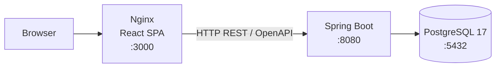
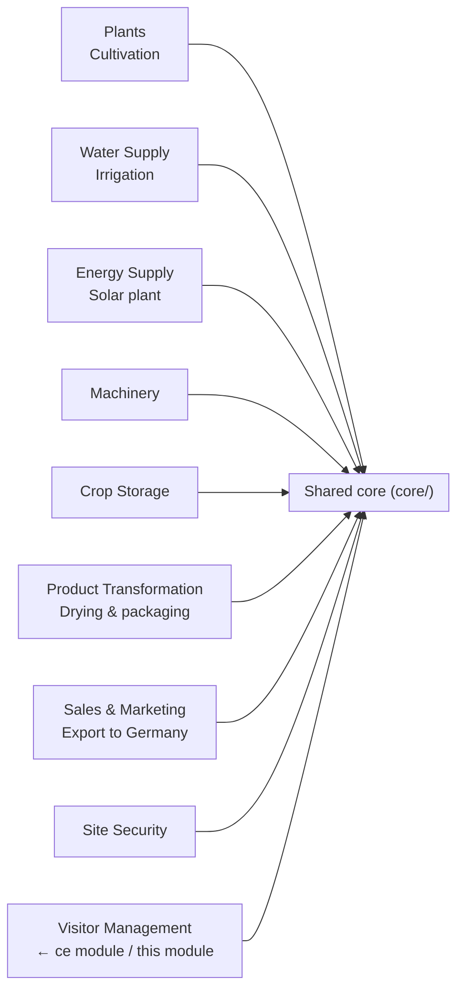
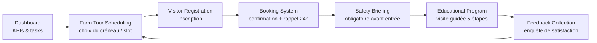
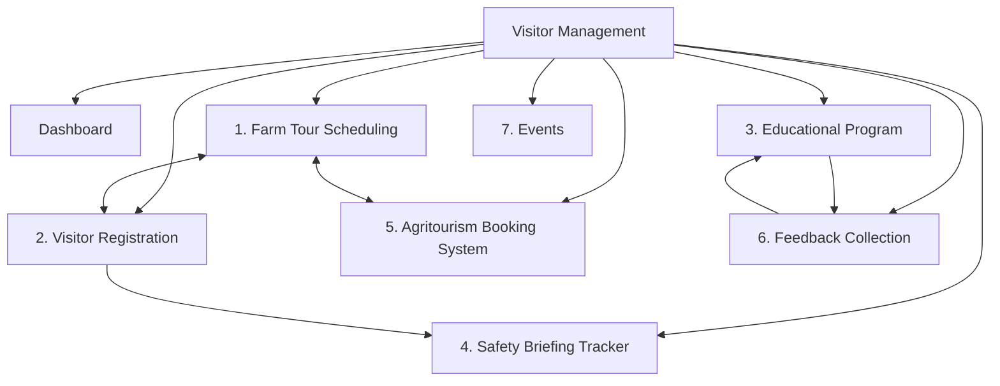
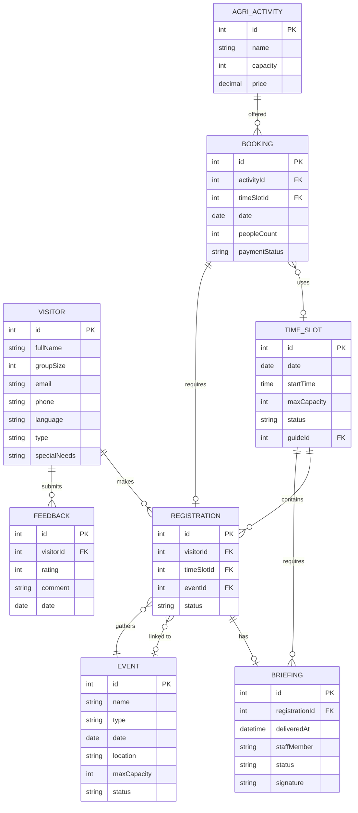

# Visitor Management — Sustainable Farm

> **Statut / Status:** Document de cadrage pour la collecte des données avant développement.
> *Scoping document for data collection before development.*

**Auteur / Author:** Alix Carine VEBAMBA — Infineon Technologies × BIT Excellence Program 2025–2026
**Projet / Project:** Ferme de production et d'export de mangues séchées durables — Banfora, Burkina Faso
**Source:** mockup `visitor-management-mockup3-circle-logo.html` + `visitor_management_documentation*.docx`

---

## 1. Vue d'ensemble du projet Sustainable Farm / Project Overview

Le projet **Sustainable Farm** est un **jumeau numérique (digital twin)** et un **système d'aide à la décision par IA** pour la chaîne d'approvisionnement de mangues séchées durables **du Burkina Faso vers l'Allemagne**.

*Sustainable Farm is a **digital twin** and **AI-powered decision support system** for a sustainable dried mango supply chain from **Burkina Faso to Germany**.*

### Architecture / Architecture

Monolithe modulaire : un backend Spring Boot (un package Java par module métier), une SPA React (un dossier `features/<module>` par module), une base PostgreSQL — orchestrés avec Docker Compose.

*Modular monolith: one Spring Boot backend (one Java package per business module), one React SPA (one `features/<module>` folder per module), one PostgreSQL database — orchestrated with Docker Compose.*

### Stack technique / Tech Stack

| Couche / Layer | Technologie |
|---|---|
| Backend | Java 21 · Spring Boot 4.1 · Maven · Spring Data JPA (Hibernate) · Validation · Actuator · Lombok · SpringDoc OpenAPI 2.8.5 |
| Frontend | React 19 · Vite 8 · Tailwind CSS 4 · Lucide React (icônes) · Recharts 3 (graphiques) · ESLint 10 |
| Persistance | PostgreSQL 17 |
| Infra | Docker Compose · Nginx (serving frontend) |

### Les 9 modules métier / The 9 business modules

| Module | Responsable pressenti / Likely owner |
|---|---|
| Energy Supply | Aida |
| Machinery | Jean-Louis |
| Site Security | Filomène |
| Plants / Water / Crop / Product / Sales | *(à confirmer / to confirm)* |
| **Visitor Management** | **Alix Carine VEBAMBA** |

---

## 2. Module Visitor Management — Présentation / Overview

**Outil interne** destiné aux équipes de la ferme (guides, accueil / front desk). **Pas** une application grand public.

*Internal tool for farm staff (guides, front desk). **Not** a public-facing application.*

Il couvre **tout le parcours d'un visiteur** : réservation → inscription → briefing sécurité → visite guidée → feedback.

*It covers the full **visitor journey**: booking → registration → safety briefing → guided tour → feedback.*

### Parcours du visiteur / Visitor journey

---

## 3. Les 7 sous-fonctionnalités / The 7 sub-features

> Le mockup affiche 8 écrans ; les docs décrivent 6 fonctionnalités. **Events** (mockup 3) est ajouté comme 7ᵉ fonctionnalité.
> *The mockup shows 8 screens; the docs describe 6 functionalities. **Events** (mockup 3) is added as a 7th feature.*

### Dashboard (vue d'ensemble / overview)

- **Données :** KPIs — visiteurs de la semaine, créneaux réservés, briefings sécurité en attente, satisfaction moyenne, événements à venir + liste des tâches (confirmations, rappels, briefings).
- **Actions staff :** consulter les KPIs, naviguer vers les fonctionnalités, suivre les tâches du jour.
- **Liens :** agrégation de tous les sous-modules.
- **À clarifier :** quels KPIs exactement ? période (semaine courante) ?

### 1. Farm Tour Scheduling

Gestion du calendrier des visites : création, modification, suivi des créneaux.

- **Données :** date/heure, groupe/visiteur associé, type de visite (individuel, groupe, école, partenaire), guide assigné, statut du créneau (disponible, réservé, complet, annulé).
- **Règles mockup :** capacité max **10 visiteurs/créneau**, **2 créneaux/jour** (9–11h, 14–16h), **fermé le dimanche**.
- **Actions staff :** créer/modifier/annuler un créneau, assigner un guide, vérifier la disponibilité, marquer une visite comme terminée.
- **Liens :** Registration (un créneau déclenche/valide une inscription), Safety (chaque visite génère un briefing), Booking (calendrier partagé).
- **À clarifier :** jours fériés, annulation météo, disponibilité des guides, capacité par guide.

### 2. Visitor Registration

Formulaire et base de données des visiteurs avant ou pendant la visite. **Source de vérité unique** sur qui vient.

- **Données :** identité (nom, contact, organisation), créneau associé, nombre de personnes, besoins spéciaux (accessibilité, langue), statut (en attente, confirmé, check-in).
- **Champ stratégique — langue :** la ferme exporte vers l'Allemagne ; un acheteur allemand peut nécessiter un traducteur (lien potentiel avec No-Reesa, app de traduction Moore–Allemand de l'année dernière).
- **Actions staff :** enregistrer un visiteur/groupe, approuver/rejeter, check-in le jour J, mettre à jour les coordonnées.
- **Liens :** Scheduling (lien avec un créneau existant), Safety (une inscription confirmée déclenche le briefing), Feedback (base de contact après la visite).
- **À clarifier :** champs obligatoires vs optionnels, processus de confirmation, règles de check-in.

### 3. Educational Program

Itinéraire que le guide suit pendant la visite — 5 étapes standardisées.

- **Données :** étapes (Welcome & safety briefing → Solar plant & tracking → Mango orchard → Dryer & processing → Wrap-up & questions), durée estimée par étape, matériel/ressources, groupe cible.
- **Actions staff :** choisir le parcours adapté au groupe, créer/mettre à jour un atelier, assigner un animateur.
- **Liens :** Scheduling (le programme détermine la durée du créneau), Registration (profil du groupe guide le choix), Feedback (retour pour ajuster le contenu).
- **À clarifier :** contenu technique de chaque étape à valider avec les responsables de module — **solaire avec Aida, machinerie avec Jean-Louis**. Coordonné par Alix.

### 4. Safety Briefing Tracker

Traçabilité des briefings sécurité obligatoires avant l'accès au site — **enjeu de responsabilité légale**.

- **Données :** visite/inscription associée, date/heure du briefing, staff ayant délivré le briefing, statut (fait, en attente, non fait), signature/confirmation du visiteur.
- **Actions staff :** enregistrer la fin d'un briefing, bloquer l'accès au site si non confirmé, générer un rappel pour les briefings en attente.
- **Liens :** Registration (toute inscription confirmée doit avoir un briefing), Scheduling (le statut détermine si la visite peut démarrer), Security (Filomène — procédures de sécurité).
- **À clarifier :** qui délivre le briefing ? comment la preuve est capturée (signature ? case à cocher sur tablette ?) ? qui consulte le journal ?

### 5. Agritourism Booking System

Gestion des offres d'activités agritouristiques et des réservations.

- **Flux (4 étapes) :** choix du créneau & type de tour → formulaire d'inscription → confirmation par email → rappel 24h avant.
- **Données :** catalogue d'activités, disponibilité/capacité, réservation (date, activité, nombre de personnes), paiement/tarification.
- **Actions staff :** créer/modifier une offre, confirmer une réservation payante, suivre le taux d'occupation.
- **Liens :** Scheduling (calendrier partagé), Registration (une réservation peut exiger une inscription complète), Energy (Aida) / Machinery (Jean-Louis) si l'activité implique des installations spécifiques.
- **À clarifier :** tarification/paiement, confirmation email, rappel 24h, activités payantes vs gratuites.

### 6. Feedback Collection

Collecte et analyse du feedback des visiteurs après la visite.

- **Données :** satisfaction globale (⭐ note), commentaires libres, visite/programme associé, date.
- **Questions mockup :** note globale, clarté du briefing sécurité, valeur éducative, recommandation.
- **Actions staff :** envoyer/proposer le questionnaire après la visite, revoir les statistiques de satisfaction, transmettre le feedback aux modules concernés.
- **Liens :** Educational Program (amélioration du contenu), Booking (influence les offres), Registration (lien avec le visiteur).
- **À clarifier :** comment compiler les réponses en **actions concrètes** (pas seulement des scores inutilisés) ?

### 7. Events

Regroupe plusieurs visiteurs/groupes sous une même occasion programmée.

- **Données :** nom, type (journée portes ouvertes, visite partenaire/acheteur, événement école, célébration communautaire), date/heure, lieu, capacité max, groupes liés, statut (planifié, confirmé, terminé, annulé).
- **Actions staff :** créer un événement, lier des groupes de visiteurs, suivre le statut.
- **Liens :** Registration/Safety/Feedback des participants restent liés à leurs dossiers visiteurs individuels.
- **À clarifier :** règles de capacité, gestion des inscriptions groupées.

---

## 4. Schéma entités proposé (ERD) / Proposed entity diagram

> Proposition initiale à affiner avec l'équipe — *Initial proposal to be refined with the team.*

---

## 5. Données à collecter auprès de l'équipe / Data to collect from the team

> Questionnaire par sous-module — à envoyer aux responsables concernés avant développement.
> *Per-sub-module questionnaire — to send to the relevant owners before development.*

### Scheduling — (à confirmer)
- [ ] Jours/heures d'ouverture réels de la ferme (2 créneaux/jour, fermé dimanche ?)
- [ ] Capacité max réelle par créneau (10 ?) et par guide
- [ ] Gestion des jours fériés, annulations météo, indisponibilité des guides
- [ ] Types de visite à prévoir (individuel, groupe, école, partenaire/acheteur)

### Registration — (à confirmer)
- [ ] Liste exacte des champs obligatoires/optionnels du formulaire
- [ ] Processus de confirmation : auto ou manuel ? qui approuve ?
- [ ] Règle de check-in le jour de la visite
- [ ] Langues à supporter (Français, Moore, Allemand, Anglais ?) et lien No-Reesa ?

### Educational Program — **Aida (solaire), Jean-Louis (machinerie)**
- [ ] Contenu technique exact de chaque étape (solaire, irrigation, séchage, conditionnement)
- [ ] Durées réelles des étapes et parcours types par type de groupe
- [ ] Matériel pédagogique disponible (échantillons, équipement démonstratif)

### Safety Briefing — **Filomène (sécurité)**
- [ ] Qui délivre le briefing ?
- [ ] Comment capturer la preuve : signature papier, checkbox tablette, photo ?
- [ ] Qui doit avoir accès au journal des briefings ?
- [ ] Processus en cas de briefing non fait (blocage d'accès ?)

### Booking — (à confirmer)
- [ ] Liste des activités agritouristiques (visites payantes, immersions, hébergement ?)
- [ ] Tarification et mode de paiement
- [ ] Modèle d'email de confirmation et de rappel 24h

### Feedback — (à confirmer)
- [ ] Questions exactes du questionnaire (les 4 du mockup suffisent ?)
- [ ] Comment compiler les résultats en actions concrètes (qui ? fréquence ?)

### Events — (à confirmer)
- [ ] Types d'événements réels (portes ouvertes, acheteurs, écoles, communautaire)
- [ ] Règles de capacité et d'inscription groupée

### Intégration inter-modules — **toute l'équipe**
- [ ] Base de données partagée ou modules indépendants avec API ?
- [ ] Contrats d'API entre modules (ex. Visitor ↔ Security, Visitor ↔ Energy/Machinery)
- [ ] Stack recommandée par le programme (aucune consigne reçue pour l'instant)

---

## 6. Questions ouvertes / Open questions

1. **Intégration** : quel niveau d'intégration entre les modules (DB partagée vs indépendante) ?
2. **Stack** : y a-t-il une recommandation de stack du programme ? (aucune consigne reçue)
3. **Events** : fonctionnalité ajoutée depuis le mockup 3 — validée comme périmètre du module ?
4. **Langue** : les acheteurs allemands ont-ils besoin de support de traduction intégré (No-Reesa) ?
5. **Autorité** : qui valide les règles métier (capacités, tarifs, processus sécurité) ?